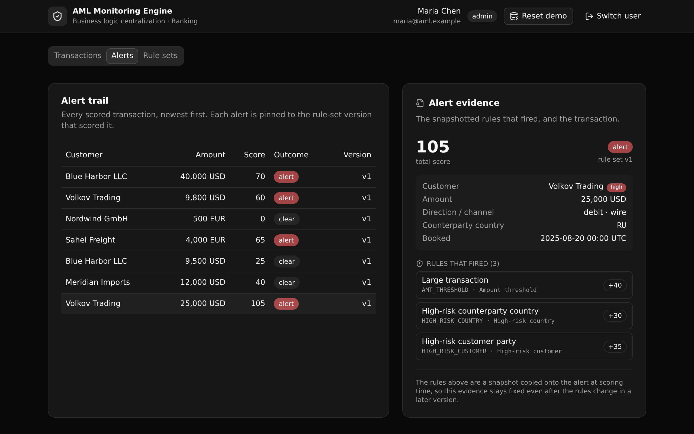

# AML Transaction-Monitoring Rules Engine

One governed, versioned scoring API that every payment rail and case tool calls, so the same
rules screen every transaction the same way, and every alert names the exact rule and version
that fired.

Built with [XanoTS](https://www.npmjs.com/package/@xanots/sdk): a typed Xano backend authored in
TypeScript, plus a React and Vite frontend that talks to it through one shared contract.



**6 tables · 12 APIs · 1 shared function**

## What it demonstrates

This is a **business logic centralization** template for **banking and financial services**. A
bank's anti-money-laundering rules usually live in scattered scripts across each payment channel,
so the same transaction can be screened differently depending on where it enters. This app pulls
that logic into one place:

- **The rules are data, not code.** Each monitoring rule is a row in a versioned rule set
  (an amount threshold, a high-risk country list, a structuring band, a high-risk customer flag).
  Tightening a rule is a new version, never a code change.
- **One shared function scores every transaction.** Both the scoring endpoint and the demo seed
  call the same `score_transaction` function, so sample data and live traffic are screened by the
  identical rules.
- **Every alert is explainable.** An alert snapshots the rule-set version and the exact rules that
  fired at scoring time, so the evidence stays fixed even after the rules change later.
- **Access is enforced at the API layer by role.** Analysts and admins author rules, only admins
  activate a version, and viewers read alerts. The checks live on the endpoints (RBAC), not in the
  database rows.

An evaluator cares because it shows a real governed workflow: a versioned rule set, a state
transition (draft to active), a snapshotted audit trail, and role-based access, all in typed Xano
defs with a working frontend on top.

## Repo layout

```
aml-transaction-monitoring-engine/
├── xano/                       the typed Xano backend
│   ├── tables/                 users, customers, transactions, rule_sets, monitoring_rules, alerts
│   ├── functions/              score_transaction (the shared scoring logic)
│   ├── api/                    the API group + 12 endpoints
│   ├── index.ts                registers everything onto one workspace()
│   └── xano.lock               pinned object identities (committed)
├── frontend/                   React + Vite + Tailwind v4 + shadcn/ui
│   └── src/lib/api.ts          the one contract: paths + types derived from the query defs
└── docs/                       the landing page served by GitHub Pages
```

## API surface

All endpoints live under one API group, `api:aml`. Access is checked on the endpoint.

| Method | Path | What it enforces |
| --- | --- | --- |
| POST | `/api:aml/auth/login` | Verify email and password, mint a Bearer token |
| POST | `/api:aml/txn/ingest` | Persist a transaction (signed in); typed inputs reject bad currency, direction, channel |
| GET | `/api:aml/txn/list` | Transactions plus the customer roster (signed in) |
| POST | `/api:aml/score/run` | Score a transaction against the active version, write an alert (signed in) |
| GET | `/api:aml/alerts/list` | The alert trail, newest first (signed in) |
| GET | `/api:aml/alerts/detail/{alert_id}` | One alert with its snapshotted rules and the transaction (signed in) |
| GET | `/api:aml/rulesets/list` | Every version and every rule (signed in) |
| GET | `/api:aml/rulesets/rules` | The rules of one version (signed in) |
| POST | `/api:aml/rulesets/draft` | Clone the active version into a draft (admin or analyst) |
| POST | `/api:aml/rulesets/rule-update` | Edit a rule on a draft version only (admin or analyst) |
| POST | `/api:aml/rulesets/activate` | Activate a draft, retire the prior active (admin only) |
| POST | `/api:aml/seed/reset` | Truncate and reinstall the demo fixture, then score it (public bootstrap) |

## The demo, end to end

1. **Sign in.** The seed installs three accounts: an admin, an analyst, and a viewer. The role
   drives what you can do.
2. **Score a transaction.** Pick one and run scoring, or ingest a new one. The result names the
   score, the outcome, the version, and each rule that fired.
3. **Read the evidence.** Open an alert to see the snapshotted rules, the score, the version, and
   the transaction behind it.
4. **Tighten a rule in a new version.** Clone the active set into a draft, raise a weight or lower
   a threshold, then activate it. Re-score the same transaction and watch a new alert appear that
   references the new version. A transaction that cleared before can alert now, and the old alert
   stays pinned to the version that produced it.

## Quick start

You need a free [Xano](https://xano.com) account.

```bash
git clone https://github.com/xano-scratch/aml-transaction-monitoring-engine.git
cd aml-transaction-monitoring-engine
npm install
npx xanots login          # authenticate with Xano (one time)
npm run xano:deploy       # builds the frontend, deploys the backend, prints the live URL
```

`npm run xano:deploy` deploys to a fresh, auto-expiring environment and hosts the frontend on it.
Open the printed URL, then click **Reset demo data** on the sign-in screen (or call
`POST /api:aml/seed/reset`) to load the customers, transactions, active rule set, and the three
role accounts, and to score every transaction.

Other scripts:

- `npm run typecheck` — type-check the backend and frontend.
- `npm run xano:export` — compile the backend to `workspace.json` without deploying.
- `npm run dev` — run the frontend locally against a deployed backend (set `VITE_XANO_HOST`).

## FAQ

**Is the scoring logic in the database?** No. The rules are rows, and one Xano function reads the
active version's rules and scores a transaction against them. Access control is on the API
endpoints (role-based), not on the rows.

**Why snapshot the fired rules onto the alert?** So an alert stays explainable. If you read an
alert months later, it shows the rules and version that produced it, even if the rules have changed
since.

**Can I add a rule type?** Yes. Add a case to the `score_transaction` function and a matching
`rule_type` value, then seed a rule that uses it.

**How do I reset the data?** Call `POST /api:aml/seed/reset`, or use the **Reset demo** button in
the app. A deploy is a full replace, so redeploying also gives you a clean slate.

## License

MIT. See [LICENSE](LICENSE).
